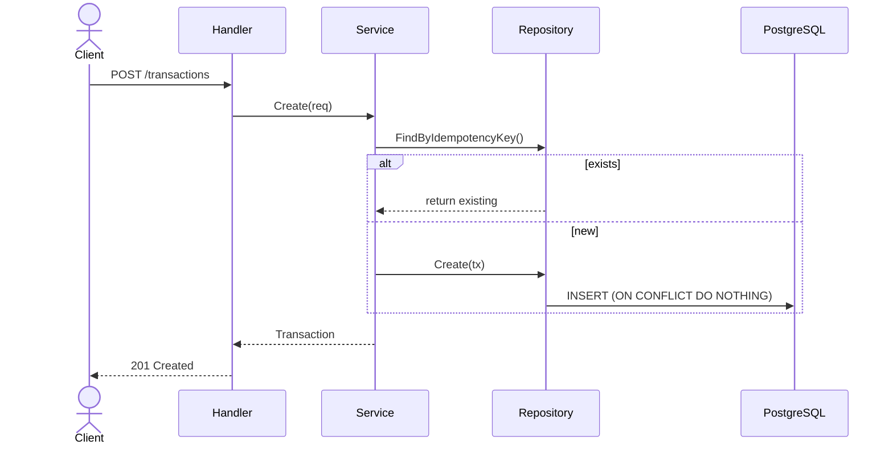

## Architecture

```mermaid
flowchart LR
    C[Client]
    H[HTTP Handler Gin]
    S[Transaction Service]
    G[Idempotency Guard]
    R[Repository]
    DB[(PostgreSQL Ledger)]

    C -->|POST /transactions| H
    H -->|Create(req)| S
    S -->|check| G
    S -->|FindByIdempotencyKey / Create| R
    R -->|INSERT / SELECT| DB
```

## Sequence Diagram

