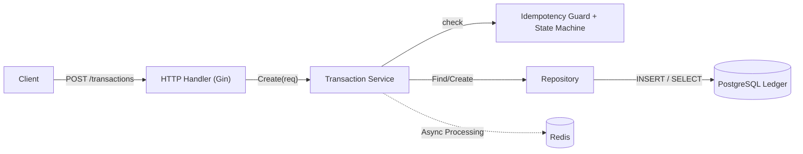
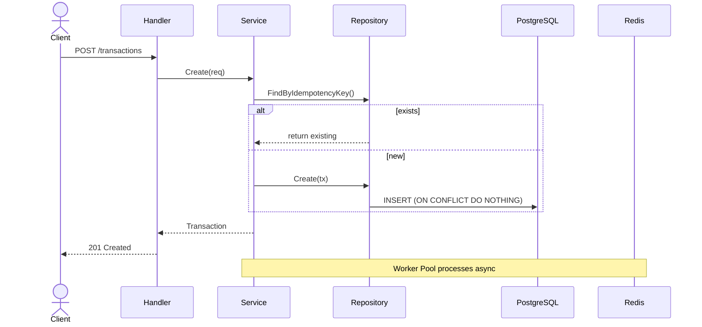

## Architecture



## Sequence Diagram



## Key Production Features

- Idempotent Transaction API
- Finite State Machine with safe state transitions
- Redis distributed locking
- Worker pool for background processing
- Webhook handler with HMAC signature validation
- Tokenization service for PCI DSS scope reduction
- Redis-based rate limiting
- Clean Architecture:
  - Domain
  - Application
  - Infrastructure

---

## How to Run

### Start Dependencies

```bash
docker-compose up -d
```

### Run API

```bash
go run cmd/api/main.go
```

---

## Test API

```bash
curl -X POST http://localhost:8080/api/v1/transactions \
  -H "Content-Type: application/json" \
  -d '{
    "idempotency_key": "test-001",
    "source_wallet_id": "w001",
    "dest_wallet_id": "w002",
    "amount": 100000,
    "currency": "IDR"
  }'
```