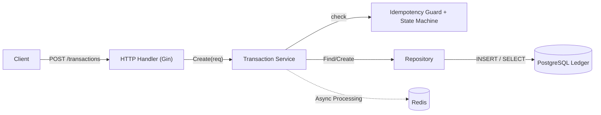
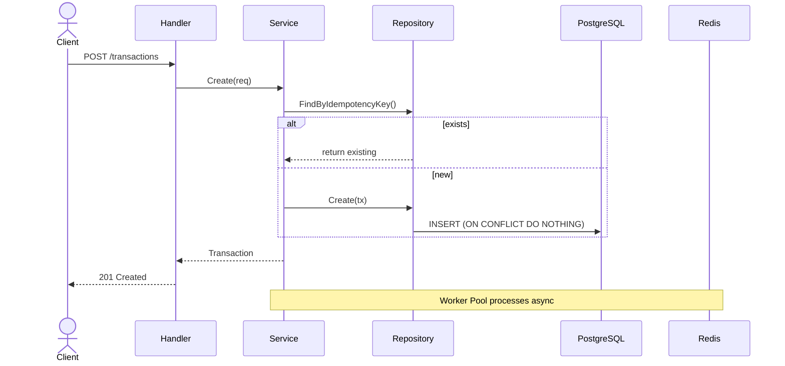

## Architecture

## Sequence Diagram

## Key Production Features
Idempotent Transaction API
Finite State Machine with safe transitions
Redis distributed locking
Worker Pool for background processing
Webhook handler with HMAC signature validation
Tokenization service (PCI DSS scope reduction)
Rate limiting using Redis
Clean Architecture (Domain / Application / Infrastructure)

How to Run
