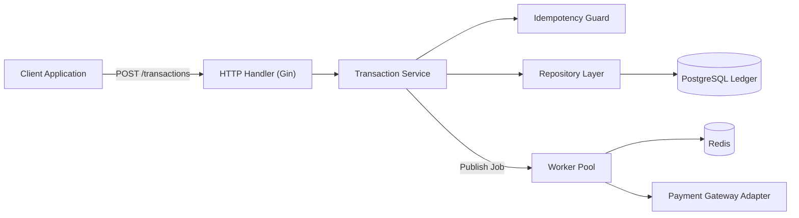
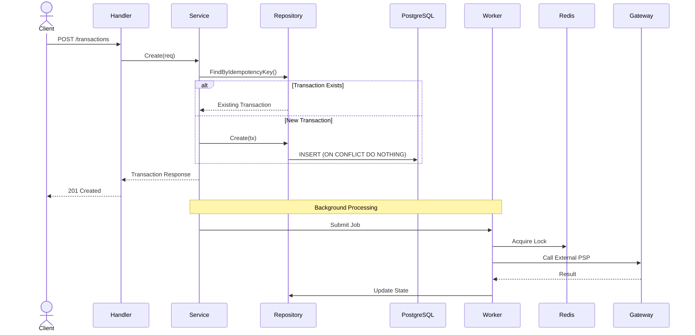

## Architecture



### Architecture Overview

The service follows a layered architecture:

* **HTTP Layer** handles request validation and response formatting.
* **Service Layer** contains business rules and transaction orchestration.
* **Repository Layer** isolates database access.
* **Worker Pool** processes asynchronous tasks without blocking API requests.
* **Redis** provides distributed locking, state coordination, and rate limiting.
* **Gateway Adapter** manages communication with external payment providers using resilience patterns such as circuit breakers and retries.

---

## Transaction Processing Flow



---

## Production Features

### Reliability

* Idempotent transaction creation
* Safe retry handling
* Redis distributed locking
* Optimistic database operations
* Circuit breaker protection
* Transaction state recovery

### Transaction Processing

* Finite State Machine (FSM)
* Validated state transitions
* Asynchronous processing pipeline
* Worker pool execution model
* External PSP integration

### Security

* HMAC webhook verification
* Request validation
* Tokenization service
* PCI DSS scope reduction

### Observability

* Structured logging with Zap
* Correlation and Request IDs
* Health check endpoints
* Metrics-ready architecture

### Platform

* PostgreSQL persistence
* Redis caching and locking
* Configuration management via Viper
* Redis-backed rate limiting

---

## Running Locally

### Start Infrastructure

```bash
docker compose up -d
```

### Run Application

```bash
go run cmd/api/main.go
```

### Build Binary

```bash
go build -o bin/api cmd/api/main.go
./bin/api
```

---

## API Example

### Create Transaction

```bash
curl -X POST http://localhost:8080/api/v1/transactions \
  -H "Content-Type: application/json" \
  -d '{
    "idempotency_key": "test-001",
    "source_wallet_id": "w001",
    "dest_wallet_id": "w002",
    "amount": 100000,
    "currency": "IDR"
  }'
```

### Example Response

```json
{
  "transaction_id": "trx_123456",
  "status": "PENDING",
  "amount": 100000,
  "currency": "IDR"
}
```

---

## Tech Stack

| Component        | Technology      |
| ---------------- | --------------- |
| Language         | Go              |
| HTTP Framework   | Gin             |
| Database         | PostgreSQL      |
| Cache / Locking  | Redis           |
| Logging          | Zap             |
| Configuration    | Viper           |
| Containerization | Docker          |
| Resilience       | Circuit Breaker |
| Background Jobs  | Worker Pool     |

---

## Design Goals

* High throughput transaction processing
* Exactly-once transaction creation semantics
* Resilience against external PSP failures
* Horizontal scalability
* Production-grade observability
* Clean and testable architecture

```
